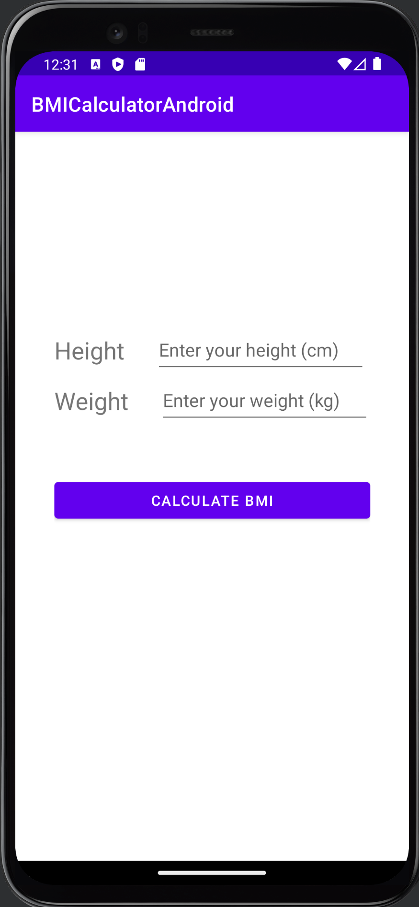
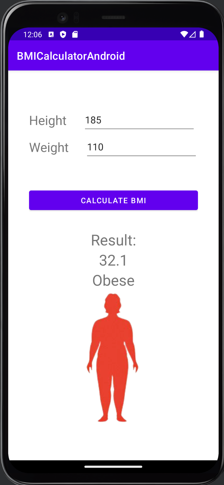

# About
My first experience with Android development. A simple BMI calculator as a school assignment.

# To do
- Add input validation. Explore data binding, especially that which is done with XML, seems neat.

# Preview

